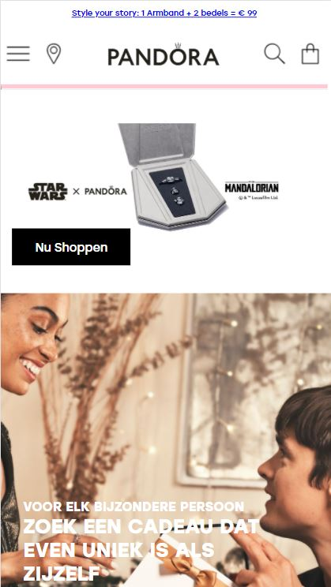
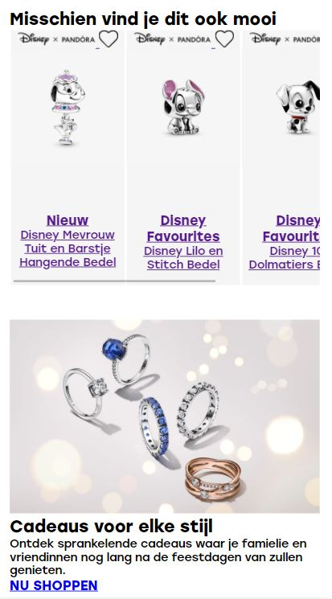

# Procesverslag
Markdown is een simpele manier om HTML te schrijven.  
Markdown cheat cheet: [Hulp bij het schrijven van Markdown](https://github.com/adam-p/markdown-here/wiki/Markdown-Cheatsheet).

Nb. De standaardstructuur en de spartaanse opmaak van de README.md zijn helemaal prima. Het gaat om de inhoud van je procesverslag. Besteedt de tijd voor pracht en praal aan je website.

Nb. Door *open* toe te voegen aan een *details* element kun je deze standaard open zetten. Fijn om dat steeds voor de relevante stuk(ken) te doen.

## Jij

uitwerken voor kick-off werkgroep

### Auteur:
Aris Rosbach - 500800470

#### Je startniveau:
Niveau rood (met een beetje Zwart)

#### Je focus:
Mijn focus wordt responsive als ik er tijd voor heb ga ik aan de slag met de surface plane.
 

## Je website

uitwerken voor kick-off werkgroep

### Je opdracht:
Ik ga de PANDORA website namaken: https://nl.pandora.net/nl/

#### Screenshot(s) van de eerste pagina (small screen): 
Home 

#### Screenshot(s) van de tweede pagina (small screen):
Verzorging en Onderhoud 

 

## Breakdownschets (week 1)

uitwerken na afloop 2e werkgroep

### De hele Home pagina: 

### De hele Onderhoud pagina: 

### Dynamische delen (bijv menu): 

### Nog meer dynamische delen prt 2: 

## Voortgang 1 (week 2)

uitwerken voor 1e voortgang

### Stand van zaken
Voor nu heb ik alle HTML van de eerste pagina gemaakt en ook al erg veel vormgegeven met onder andere
flex-box en positioning. Hierbij lag de focus nog bij het maken van een mobiele scherm. 
Ik vind het af en toe nog wel eens lastig om de juiste manier te vinden om 
iets te laten werken maar ben voor nu al erg tevreden met mijn voortgang!  

 

### Agenda voor meeting
samen opgesteld met mijn groepje:

| Anneke Steller | Max van Liempt   | Fleur Oostingh | Zoë Reijinga     | Aris Rosbach     |
| ---            | ---              | ---            | ---              | ---              |
| Zij loopt nog achter en wil dit benoemen  | Heeft de vraag hoe je een div goed gebruikt | Heeft ook geen agenda punt | wil weten hoe je een zoekbalk maakt | ik heb een probleem met een margin |
| ...    | ...    | ...    | ...    | ...    |

### Verslag van meeting
hier na afloop snel de uitkomsten van de meeting vastleggen

- punt 1
- punt 2
- nog een punt
- ...

## Voortgang 2 (week 3)

uitwerken voor 2e voortgang

### Stand van zaken
hier dit ging goed & dit was lastig (neem ook screenshots op van delen van je website en code)

### Agenda voor meeting
samen met je groepje opstellen

| student 1      | student 2          | student 3    | student 4        |
| ---            | ---                | ---          | ---              |
| dit bespreken  | en dit             | en ik dit    | en dan ik dat    |
| en dat ook nog | dit als er tijd is | nog een punt | dit wil ik zeker |
| ...            | ...                | ...          | ...              |

### Verslag van meeting
hier na afloop snel de uitkomsten van de meeting vastleggen

- punt 1
- punt 2
- nog een punt
- ...

## Toegankelijkheidstest (week 4)

uitwerken na test in 8e voortgang

### Bevindingen
Lijst met je bevindingen die in de test naar voren kwamen:

#### Titel eerste bevinding
Hier korte omschrijving (met indien nodig een afbeelding)

Hier een omschrijving van hoe het opgelost kan worden (met indien nodig een afbeelding)

#### Titel tweede bevinding. 
Hier korte omschrijving (met indien nodig een afbeelding)

Hier een omschrijving van hoe het opgelost kan worden (met indien nodig een afbeelding)

#### Titel volgende bevinding. 
Hier korte omschrijving (met indien nodig een afbeelding)

Hier een omschrijving van hoe het opgelost kan worden (met indien nodig een afbeelding)

#### Titel nog een bevinding. 
Hier korte omschrijving (met indien nodig een afbeelding)

Hier een omschrijving van hoe het opgelost kan worden (met indien nodig een afbeelding)

## Voortgang 3 (week 4)

uitwerken voor 3e voortgang

### Stand van zaken
hier dit ging goed & dit was lastig (neem ook screenshots op van delen van je website en code)

### Agenda voor meeting
samen met je groepje opstellen

| student 1      | student 2          | student 3    | student 4        |
| ---            | ---                | ---          | ---              |
| dit bespreken  | en dit             | en ik dit    | en dan ik dat    |
| en dat ook nog | dit als er tijd is | nog een punt | dit wil ik zeker |
| ...            | ...                | ...          | ...              |

### Verslag van meeting
hier na afloop snel de uitkomsten van de meeting vastleggen

- punt 1
- punt 2
- nog een punt
- ...

## Eindgesprek (week 5)

uitwerken voor eindgesprek

### Stand van zaken
hier dit ging goed & dit was lastig (neem ook screenshots op van delen van je website en code)

### Screenshot(s)

hier screenshot(s) van je eindresultaat

## Bronnenlijst

continu bijhouden terwijl je werkt

Nb. Wees specifiek ('css-tricks' als bron is bijv. niet specifiek genoeg).

1. https://nl.pandora.net/nl/
2. https://codepen.io/shooft/pen/vYZKQPX
3. https://css-tricks.com/snippets/css/a-guide-to-flexbox/
4. ...
5. ...
6. ...

