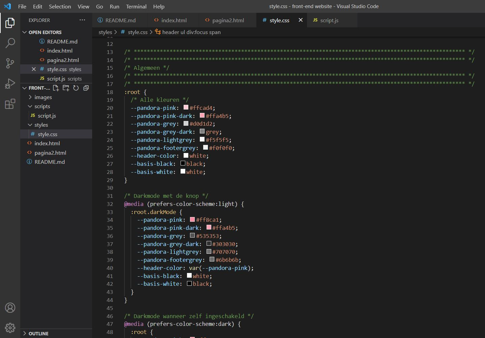
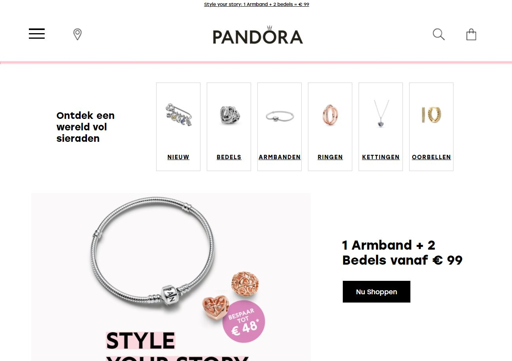

# Procesverslag
Markdown is een simpele manier om HTML te schrijven.  
Markdown cheat cheet: [Hulp bij het schrijven van Markdown](https://github.com/adam-p/markdown-here/wiki/Markdown-Cheatsheet).

Nb. De standaardstructuur en de spartaanse opmaak van de README.md zijn helemaal prima. Het gaat om de inhoud van je procesverslag. Besteedt de tijd voor pracht en praal aan je website.

Nb. Door *open* toe te voegen aan een *details* element kun je deze standaard open zetten. Fijn om dat steeds voor de relevante stuk(ken) te doen.

## Jij

uitwerken voor kick-off werkgroep

### Auteur:
Aris Rosbach - 500800470

#### Je startniveau:
Niveau rood (met een beetje Zwart)

#### Je focus:
Mijn focus wordt responsive als ik er tijd voor heb ga ik aan de slag met de surface plane.
 

## Je website

uitwerken voor kick-off werkgroep

### Je opdracht:
Ik ga de PANDORA website namaken: https://nl.pandora.net/nl/

#### Screenshot(s) van de eerste pagina (small screen): 
Home 

#### Screenshot(s) van de tweede pagina (small screen):
Verzorging en Onderhoud 

 

## Breakdownschets (week 1)

uitwerken na afloop 2e werkgroep

### De hele Home pagina: 

### De hele Onderhoud pagina: 

### Dynamische delen (bijv menu): 

### Nog meer dynamische delen prt 2: 

## Voortgang 1 (week 2)

uitwerken voor 1e voortgang

### Stand van zaken
Voor nu heb ik alle HTML van de eerste pagina gemaakt en ook al erg veel vormgegeven met onder andere
flex-box en positioning. Hierbij lag de focus nog bij het maken van een mobiele scherm. 
Ik vind het af en toe nog wel eens lastig om de juiste manier te vinden om 
iets te laten werken maar ben voor nu al erg tevreden met mijn voortgang!  

### Agenda voor meeting
samen opgesteld met mijn groepje:

| Anneke Steller | Max van Liempt   | Fleur Oostingh | Zoë Reijinga     | Aris Rosbach     |
| ---            | ---              | ---            | ---              | ---              |
| Zij loopt nog achter en wil dit benoemen  | Heeft geen agenda punt | Heeft de vraag hoe je een div goed gebruikt | Heeft ook geen vragen | Ik heb een probleem met een margin |
| ...    | ...    | ...    | ...    | ...    |

### Verslag van meeting
De uitkomsten van de meeting:

- Bij Anneke kwam het er opneer dat ze eigenlijk lang niet zo ver achterloopt als ze denkt. Ze loopt namelijk niet achter als het gaat om de theorie en huiswerkopdrachten.
- Fleur had nu de vraag over wanneer je wel en niet een div gebruikt. Zij had een voorbeeld met allerlei foto's. Dit zou ze dan beter in een list kunnen zetten dan in divjes. Een div gebruik je dus meer voor het stylen. Zo gebruik ik een div om een h2 en h3 samen over een afbeelding te kunnen plaatsen. Dit is wel een goede manier van een div gebruiken, dus dat is fijn om te weten.
- Als laatste had ik nog een vraag over het gebruik van een margin. Ik heb om mijn main een margin gezet, maar daarvan wil ik dat 1 afbeelding die margin overschrijft. Ik was al goed opweg om een margin: 0 -1em; te gebruiken, maar liep daarna vast. Nu heb ik de vw unit geleerd. Ik had het namelijk kunnen oplossen op een moeilijke manier: calc(100% + 2em). Maar de vw zeg je dat (in dit geval) de afbeelding zo breed moet zijn als de view port. Dus zo breed als je scherm. Zo heb ik mijn probleem kunnen oplossen.

Al met al waren we alle 5 eigenlijk goed bezig en is het nu zaak om volgende week deze puntjes op de i af te hebben zodat we verder kunnen gaan met grid.

## Voortgang 2 (week 3)

uitwerken voor 2e voortgang

### Stand van zaken
Op dit moment heb ik alle content op mijn 1e pagina staan. Daarnaast ben ik ook bijna klaar met de 2e pagina. Voor nu zien de schermen er goed uit op een mobiel scherm. Ik heb al wat JavaScript geschreven en zelfs al een animatie toegevoegd. Dus vanaf nu ga ik mij richten op het responsive maken van mijn website. Hierbij ga ik gebruik maken van grid, iets wat ik nog niet ken en dus moet gaan uitzoeken hoe ik het allemaal precies kan toepassen.  

### Agenda voor meeting
samen opgesteld met mijn groepje:

| Max van Liempt  | Zoe Reijinga  | Laurens Duin  | Aris Rosbach  |
| ---            | ---                | ---          | ---              |
| Vroeg zich af hoe hij zijn divjes kan vervangen voor iets anders | Heeft geen specifieke vraag | Heeft ook geen agenda punten | Ik vroeg me af of ze nog tips hadden voor wanneer ik ga beginnen met grid |
| ...            | ...                | ...          | ...              |

### Verslag van meeting
De uitkomsten van de meeting:

Eigenlijk had niemand van ons echt iets waarmee die vast liep dus vroegen we de studentassistenten meer om wat tips.
- Ik begon met mijn code te laten zien en vroeg vooral of ze nog tips hadden voor wanneer ik ga beginnen met grid. Eigenlijk kwam het er op neer dat ik het vooral gewoon moet uitproberen en dat het dan vanzelf wel duidelijk is. Wel moet ik opletten met media queries dat ik nu van een klein scherm naar een groot scherm ga dus dat ik daar wel aan denk.
- Ook hebben we de code van Zoë en Laurens gezien. Wat me daar opviel was dat Zoë ook in de HTML comments had toegevoegd bij haar secties. Dit zodat ze weet de hoeveelste sectie dit is zodat dat handiger werkt in je CSS. Dus dat wil ik ook toevoegen.
- Max liet ook zijn code zien en toen viel het de klassenassistenten op dat hij veel divjes had. Hij vroeg zich vooral af waarmee hij deze kon vervangen. Hierbij kun je denken aan articles of list items. Iets wat ik ook moet onthouden om zoveel mogelijk divjes te voorkomen.

Verder zag bij iedereen de code er erg netjes uit en waren we nog goed op schema. 

## Toegankelijkheidstest (week 4)

uitwerken na test in 8e voortgang

### Bevindingen
Hieronder zullen al mijn bevindingen komen te staan:

#### Screen reader
Met heel veel moeite en gepriegel met de knoppen op mijn toetsenbord heb ik het voor elkaar gekregen om met een screenreader door mijn gemaakte website te gaan.

De screen reader leest alle linkjes van boven naar beneden voor. 
Wanneer die bij het hamburgermenu komt is dit wel wat verwarrend want als je op enter klikt, wordt het menu uitgeklapt. Er wordt dan gezegd: Selectievakje ingeschakeld. 
Al is dat natuurlijk niet echt relevant omdat je als je blind bent toch niet alle linkjes ziet maar deze worden wel gewoon voorgelezen dus dat is goed. 

Ook lukt het me om door het verdere menu te gaan, nadat alle linkjes in het hamburger menu zijn voorgelezen. Hierbij leest hij de naam van de icoon afbeelding voor. Is eigenlijk wel duidelijk genoeg.

(de focus state is hier nog niet helemaal zoals ik in gedachten heb want de tekst is plots naar links uitgelijnd, dit wordt nog aangepast.)
Wanneer ik door de verschillende sieraden categorieën heen tab krijg ik het volgende te horen: “Koppeling, klik hier om naar alle bedels te gaan. B E D E L S”
Ik snap niet helemaal waarom hij daar het woord bedels begint te spellen. Terwijl bij de andere categorieën hij gewoon het woord zegt. 
Want het is logisch dat hij eerst de alt van de afbeelding voorleest en vervolgens de heading omdat dat binnen de link is geplaatst.

Het is omdat ik het weet dat je wanneer je op het hartje klikt dat je de bedel toevoegt aan je verlanglijstje. Dus wanneer ik daar weet te komen met de screenreader en op enter klikt kan ik dat wel activeren. Maar dat krijg ik niet te horen ofzo.

De buttons zijn wel gewoon duidelijk. Daar wordt gezegd: Nu shoppen, knop. Dus je weet dat je er kunt shoppen en dat het een knop is waar je op kunt doorklikken.

De socialbuttons vond ik ook duidelijk. Dit komt omdat de afbeeldingen worden voorgelezen en die hebben een goede duidelijk en korte alt tekst.
En eigenlijk is ook het formulier erg duidelijk. Zodra je daar komt vertelt het je eerst een gek woord wat ik niet kan verstaan, maar daarna zegt het de placeholder tekst, daar heb ik staan: Typ je mail in. Dus dit is echt heel duidelijk zo. Wanneer je hebt getypt is het daarna ook heel duidelijk dat je met de knop ernaast kunt verzenden.

#### Spasmes/Parkinson 

Om dit na te bootsen kregen we schokjes door onze arm waardoor je erg begint te trillen en schokken.
Vooral met mijn muis navigeren vond ik het moeilijkst. Door het trillen en schokken was is soms per ongeluk aan het klikken op niets. Maar wanneer je dit een beetje onder controle weet te houden merk je dat ik mijn knoppen groot genoeg heb gemaakt want hier kun je prima op klikken.
Ook is dit om een telefoon echt best wel goed te doen.
Wel moet je je echt concerteren en ben je daardoor wel wat langzamer in alles wat je doet.

#### Slechte motoriek
Met elastiekjes om je vingers hebben we dit nagebootst. 
Dit maak het gebruiken van mijn site niet perse moeilijker. Wel is het fijn dat icoontjes groter worden als je er overheen hovert. Waardoor je het gevoel hebt dat je er niet naast kunt klikken.

#### Concentratieproblemen
Om het afgeleiden na te bootsen gingen we een ballon hooghouden.
Alleen als je in mijn hamburger menu focust dan moet je zelf wel bedenken dat het stippellijntje hoort bij het woord waar die onder staat. Nu staat die erg in het midden en als je het even niet weet kan dat verwarrend zijn.
Bij mijn formulier is wel duidelijk dat je erin bezig weet. Alleen is dus niet duidelijk dat je er je email moet invullen. Wel kun je dit opmaken uit de context. Maar dit kan dus duidelijker.

#### Visuele beperkingen

##### Hemifield loss
Hierbij verlies je zicht aan je rechter kant. Dit had verder niet hele grote gevolgen voor het uiterlijk van mijn website.

##### Gele lenzen
Door de gele lenzen worden kleuren wat minder goed zichtbaar. 
Ook deze had niet heel veel grote gevolgen voor het uiterlijk van mijn website. Het enige is dat ik de roze letterkleur als je over het hamburgermenu hovert niet lichter moet maken.

##### Blur
Met blur zie je heel wazig. Hierbij zie je je muis bijna niet. Bij mijn site worden sommige items wat groter of veranderen van kleur als je er over heen gaat met je muis. Hierdoor kun je wel ongeveer weten waar je bent en of je op iets kunt klikken.
Daarnaast is het Pandora Logo in de navigatie heel groot. Dus is met veel concentratie weet je wel dat je op de Pandora site zit.

##### Low contrast

Met deze bril is de contrast tussen kleuren erg laag. 
Vooral hierbij werd duidelijk dat de roze fontkleur als je hovert echt niet goed meer is te lezen. Deze kleur moet wat donkerder worden om niet weg te vallen tegen het grijs. Of het grijs moet wat lichter worden van kleur.
Wel is het een goede keus geweest om de buttons roze te maken als je er over heen hovert. Vooral de button die over de afbeelding heen staat is nu wel te zien want anders viel deze bijna weg door de zwarte kleur.

##### Field loss/Tunnelvisie
Hier zie je alleen nog door een heel klein cirkeltje. Hierdoor moet je je heel erg concentreren als je iets wilt zien. 
Ook hierbij is het lichte roze als tekstkleur als je er overheen gaat niet de beste keuze. Vooral het bovenste zinnetje die helemaal bovenaan de header staat is dan echt niet meer goed te lezen.

##### Central field loss
Met deze bril is het nog steeds niet goed na te bootsen hoe vervelend dit wel niet is. Nu kan je om de stip in het midden heen kijken maar in het echt is dit natuurlijk niet mogelijk.
Wat helpt is dat mijn headings echt wel heel groot zijn.

##### Suikerziekte/Combined loss
Hierbij zitten er allemaal witte vlekken in je beeld.
Ook nu kan je er weer omheen kijken, maar in het echt natuurlijk niet. Ook hierbij is het fijn dat je wanneer je hovert iconen groter worden en dat mijn headings groot zijn.

### Oplossingen:

#### Oplossing 1
Wat ik duidelijk moet veranderen is de roze hover kleur. Deze heb ik nu donkerder gemaakt. Daarnaast heb ik bij het hamburgermenu de kleur grijs veranderd naar en lichtere variant.

Ook heb ik het formulier iets duidelijker gemaakt door boven de input neer te zetten dat je daar je email moet invullen.

Daarnaast heb ik de stippellijn in de focus state duidelijker gemaakt. Eerst stond die tussen de linkjes in maar nu is deze iets dichter onder de gefocuste link  gezet, waardoor er geen verwarring meer ontstaat waar het streepje bij hoort.

## Voortgang 3 (week 4)

uitwerken voor 3e voortgang

### Stand van zaken
Eigenlijk ben ik een heel eind met mijn website. Zowel mijn 1e als 2e pagina is nu responsive. Bij sommige sections heb ik hiervoor grid gebruikt. Daarnaast heb ik ook alle hover, focus en active states toegevoegd. Deze wil ik alleen nu nog mooi maken, want het feit dat ze zijn toegevoegd betekend niet dat ze allemaal even mooi werken, vooral in verschillende schermformaten doen ze soms nog wel eens lastig.
Voor nu wil ik dan ook alle puntjes op de i gaan zetten. Ik wil al mijn code nog eens langs om onnodige weg te halen. En ik begrijp nu wel wat er staat maar de comments wil ik wat verder uitbereiden zodat iedereen die er naar kijkt het snapt. Dus daar ben ik ook mee bezig.  

### Agenda voor meeting
ook dit keer weer samen opgesteld met mijn groepje:

| Max van Liempt  | Zoe Reijinga  | Laurens Duin  | Aris Rosbach  |
| ---            | ---                | ---          | ---              |
| Heeft geen vragen | Heeft ook geen specifieke vraag | Heeft ook geen agendapunt | En bij mij gaat het eigenlijk ook wel goed |
| ...            | ...                | ...          | ...              |

### Verslag van meeting
Eigenlijk waren we dit keer een heel saai groepje zonder specifieke vragen. Alle 4 zijn we bezig om de puntjes op de i te zetten. 
Tijdens de meeting hebben we dus vooral even laten zien hoever we ieder waren en verteld wat we nog wilden gaan doen.

- Laurens had zijn website laten zien. Deze zag er echt al super uit. Voor nu is hij bezig om de 2e pagina helemaal af te krijgen. Hierbij had hij nog wel de vraag of het erg was dat hij veel had weggelaten in vergelijking met de "officiele" site. Maar dit is geen punt, het gaat er om dat je genoeg kunt laten zien.
- Ik heb vervolgens laten zien waar ik mee bezig was. Ook ik was al heel erg lekker bezig en ik kon laten zien dat ik bezig was geweest met responsive maken.
- Zoë was ook al heel erg ver en had verder geen vragen. Ook zij zal bezig zijn met de puntjes op de i te zetten. Wel zei ze dat Coolblue een afbeelding had gebruikt voor tekst en dat zij dat ook had gedaan. Dus voor haar nu de uitdaging om dit zelf wel als text te coderen.
- Bij Max zag alles er ook goed uit. Hij was ook al heel erg ver. Hij gaat vooral nu aan de slag nog met de hover, focus en active state want dat had hij nog niet toegepast.

Nadat we elkaars werk hadden gezien was ik zelf echt heel erg onder de indruk. Ik kreeg bijna het idee dat ik zelf opeens niet genoeg had gedaan ofzo. Ik wil opeens nog meer maken om zelf ook een nog mooiere website te maken. Maar dat komt deels denk ik ook omdat je er zelf elke dag wel naar kijkt en daardoor even uit het oog verlies hoe goed het wel niet is. Want het is gewoon heel goed!

## Eindgesprek (week 5)

uitwerken voor eindgesprek

### Stand van zaken
Ik vond dit vak echt ontzettend leuk! Ik heb vooral geleerd dat je gewoon nog meer kan met CSS dan ik in eerste instantie dacht. Zoals de animaties en een darkmode. Daarnaast is me bij dit vak duidelijk geworden dat states ervoor zorgen dat je website echt tot “leven” komt. Wat super gaaf is.
Met media queries en grid mijn website responsive maken vond ik denk ik toch echt het leukst. Hierbij kun je echt dingen helemaal anders gaan uitlijnen op verschillende schermformaten.  Dit ook wat ik echt nieuw geleerd heb binnen dit vak. Dus vooral op het begin van het gebruik ging dit wel nog echt erg stroef. Dan moest ik wel echt even doorzetten.
Wat ik ook nog wel even een dingetje vond was met JavaScript werken. Vaak snap ik wel wat er gebeurd als iets werkt. Maar als iets niet werkt, juist dan begrijp ik niet waarom. Zo weet ik nu dat JavaScript stopt als die een element niet kan vinden. 
Ook de darkmode was even zoeken. Ik had goed gewerkt met mijn kleuren in variabelen te zetten. Maar in de darkmode bleek dat ik sommige dingen nog een kleur moest geven. Dit ging vooral om de tekstkleur of bijvoorbeeld de achtergrond van mijn header. Dus dat moest ik dan nog gaan aanpassen. Net als alle afbeeldingen, die soms een witte achtergrond kleur hadden en daardoor vreselijk fel afstaken tegen de zwarte achtergrond. Ook dit heb ik zo goed mogelijk opgelost door hier en daar wat plaatjes te vervangen met een transparante achtergrond. 
Vooral op het eind twijfelde ik of ik wel echt genoeg had gemaakt en daarmee dus laat zien dat ik veel dingen begrijp. Maar eigenlijk ben ik ontzettend trots op mijn website. Soms kijk ik er naar en ben ik even totaal kwijt of ik op de “officiële” Pandora site zit, of op die van mij. Echt een goed teken, al zeg ik het zelf!  

### Screenshot(s)

Dit zijn schreenshots van mijn eindresultaat:

## Bronnenlijst

continu bijhouden terwijl je werkt

Nb. Wees specifiek ('css-tricks' als bron is bijv. niet specifiek genoeg).

1. https://nl.pandora.net/nl/
2. https://uk.pandora.net/en/
3. https://codepen.io/shooft/pen/vYZKQPX
4. https://css-tricks.com/snippets/css/a-guide-to-flexbox/
5. https://www.w3schools.com/howto/howto_css_style_hr.asp
6. https://codepen.io/erikterwan/pen/EVzeRP
7. https://codepen.io/shooft/pen/eYRdEPm
8. https://developer.mozilla.org/en-US/docs/Web/CSS/overflow
9. https://codepen.io/shooft/pen/abwLyvm
10. https://css-tricks.com/almanac/properties/a/animation/
11. https://elementor.com/help/whats-the-difference-between-px-em-rem-vw-and-vh/
12. https://www.digitalocean.com/community/tutorials/css-cropping-images-object-fit
13. https://codepen.io/shooft/pen/abwLwRO?editors=1100 
14. https://www.w3schools.com/howto/howto_css_placeholder.asp
15. https://codepen.io/shooft/pen/ExXRLXL?editors=1010s
16. https://dlo.mijnhva.nl/d2l/le/content/324289/Home

